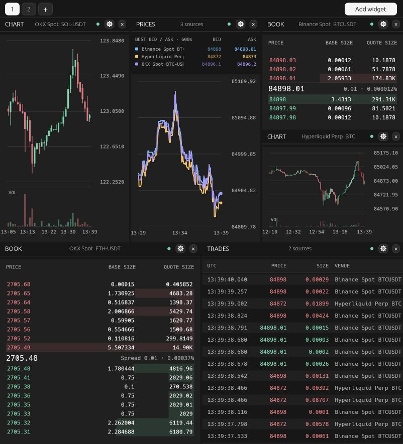
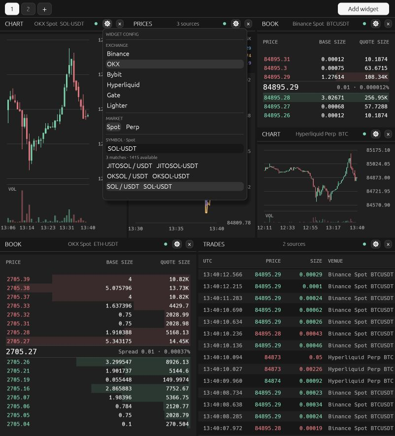

# Rust Terminal

A real-time crypto market-data terminal built in Rust. The interface runs in the browser through WebAssembly; a Rust server connects to exchange feeds and keeps the order books in sync. No JavaScript framework.

Connect a Hyperliquid wallet address from the account button beside **Add Widget** to see live open orders and perpetual positions. CHART marks orders and position entries; BOOK highlights own orders at levels present in Hyperliquid's depth feed. PRICES marks open orders for its selected sources; its config can hide them per widget. The account menu lists all open orders, including those beyond the book feed's 20 levels. Use the eye beside an account to hide its widget overlays without disconnecting it. This is read-only: no signing or API key is needed. Multiple wallet addresses can be saved locally in the browser. Hyperliquid limits live user subscriptions to 10 distinct addresses.



## What it does

- **Twelve exchanges:** Binance, OKX, Bybit, Hyperliquid, Gate, Lighter, Bitget, Aster, Bitunix, KuCoin, Kraken, and Pacifica. Choose Spot or Perp and a symbol separately for each widget.
- **Seven widgets:** live candlestick chart, scrollable order book, multi-venue price comparison, trades tape, DOM price ladder, own fills, and position history.
- **Flexible workspace:** drag widgets, resize tiles, and switch between saved terminal layouts. Settings are stored locally in the browser.
- **Live data:** exchange WebSockets for books and trades; REST snapshots for initial book depth and candle history.

Enable **Show orderflow** in PRICES config for buy/sell quote volume grouped into UTC seconds. SELL bars extend above zero, BUY below. The current second updates with each trade event. Choose a source beneath the price chart; **All sources** is available when base assets and quote currencies match. Hover either plot for per-second buy/sell volumes and delta (`Buy − Sell`) in both base and quote units. Unknown trade sides are excluded from delta and reported separately in the tooltip. Volume is collected live for up to 600 seconds, independently of the price plot's point limit.

**DOM** combines resting BID/ASK liquidity, executed SOLD/BOUGHT volume, and visible accounts' open ORDERS on one descending price ladder. Configure price grouping, a rolling trade window of 1–600 seconds, and base or quote sizes. Hover a level for both units. Scroll or drag to explore; double-click to recenter and follow the market. Executed volume is collected from live trades; unavailable book depth is marked `—`.

**FILLS** streams individual Hyperliquid account executions, including partial fills, with maker/taker, fees, and base/quote size details on hover. Filter visible accounts and symbols in config. Enable **Show markout** for editable horizons from 100 ms to 600 seconds (defaults: 1, 5, 30 seconds), in bp or percent. Markout uses the same venue’s mid-price at each horizon, signed by fill side and gross of fees. Completed measurements are fixed. `…` means pending; `—` means no valid observed quote. Quotes older than two seconds, observations started after the horizon, and missing history are excluded. Click a fill to expand its measured-horizon graph. Fills survive reconnect replay without duplicates; the latest 1,000 executions per account are kept in memory.

**POSITION** shows observed Hyperliquid positions as a live step chart with fill markers. The Y axis fits the visible values; zero is shown only when it falls within that range. Choose Spot or Perp, a symbol, visible accounts, Size / Notional / uPnL, and a 10–600 second window. Accounts can be drawn separately or summed. Perp Size updates immediately from confirmed own fills (`startPosition ± size`), using exchange timestamps across native and builder DEXs. Account snapshots reconcile Size without rolling back newer fills; duplicate and historical fills do not change it. Signed notional and uPnL use account state and wait for a snapshot reflecting the new size. Spot Size includes held balances; Spot Notional uses the selected market’s live mid-price. uPnL is available for Perp. History starts when the widget observes an account and stays in memory across terminal switches; reconnect gaps remain visible. The account eye toggle hides its series and fills. Drag vertically to move the range; scroll over the Y scale to zoom and double-click it to reset.

Drag CHART or PRICES vertically to move the price range. Scroll over the right price scale to zoom it, or use Shift + scroll over CHART; PRICES also supports scrolling over the plot. Double-click the price scale to restore automatic scaling.

In PRICES Last trades mode, **Compare % change** uses the first source's latest trade as the shared reference: `(price − reference) / reference × 100`. The first source's latest trade is 0%; all chart history, trade markers, and account orders use that same current reference. The source list shows each venue's latest difference in percent.



## Run locally

Requires Rust and [Trunk](https://github.com/trunk-rs/trunk).

```sh
rustup target add wasm32-unknown-unknown
cargo install trunk --locked
cd crates/web && trunk build --release && cd ../..
cargo run -p terminal-server --release
```

Open **http://127.0.0.1:3000**. Run `cargo test --workspace` to check the project. The same interface can also run as a native app with `cargo run -p terminal-web` while the server is running.

## Scope

Perp support covers linear contracts: Binance USDⓈ-M, OKX linear swaps, Bybit linear, Gate USDT, Hyperliquid, Lighter, Bitget USDT, Aster, Bitunix USDT, KuCoin linear, Kraken `PF_*`, and Pacifica. Inverse contracts are not included. Binance and Aster Perp publish aggregate trade events, so their tapes show each published aggregate rather than every underlying execution. Bitunix Spot currently provides a polled public order book and candle history; its public API does not expose a trade stream, so its trade tape and Last Trades comparison are unavailable. Order books contain the price levels available from each exchange's public feed; they do not expose individual orders. The terminal displays public market data and does not place trades.

KuCoin uses its public UTA feed with 500 levels per side and up to 10 ms book updates. Kraken Spot provides 1,000 levels with checksum validation; its linear Perp feed supplies a snapshot and sequenced updates. Pacifica supports both Spot and Perp, with a dedicated event-driven BBO feed for PRICES. See [API notes](docs/exchanges/kucoin-kraken-pacifica.md) for source documentation and depth limits.

## Project

- `crates/core` — shared market and WebSocket protocol types
- `crates/server` — exchange adapters, order books, and data fanout
- `crates/web` — `egui` interface for WebAssembly and native desktop

MIT licensed. See [LICENSE](LICENSE).
